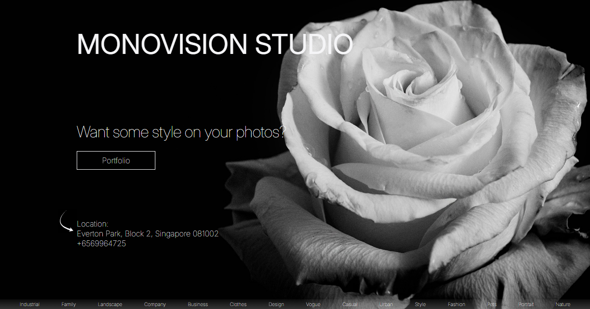

# Monovision Studio

A landing page for a black-and-white photography studio. Plain HTML and a single stylesheet —
no framework, no bundler, no build step. The interesting part is the styling: custom
properties that change value per breakpoint, so most responsive behaviour happens without
writing a second layout.

**Live demo:** https://tecna-developer.github.io/monovision-studio/



## Highlights

- **Custom properties are redefined inside `:root`, not overridden per block.** Spacing is
  declared once and the breakpoints change the variable rather than the rules that use it:

  ```css
  :root {
    --padding-inline-container: 13%;
    --section-space: 5rem;

    @media screen and (max-width: 48rem) { --padding-inline-container: 6%; }
    @media screen and (max-width: 23.4375rem) {
      --padding-inline-container: 0.9375rem;
      --section-space: 3.125rem;
    }
  }
  ```

  This relies on native CSS nesting, which is why the media queries sit inside the `:root`
  block instead of at the end of the file.

- **Percentage gutters down to a pixel floor.** The container padding stays proportional
  (13% → 6%) while the layout has room, then switches to a fixed `0.9375rem` on the
  narrowest screens, where a percentage would collapse to almost nothing.

- **Breakpoints are expressed in `rem`** — 90, 70, 64, 48, 36 and 23.4375rem — so they track
  the user's font size rather than a device width.

- **Grid is used only where the relationship is two-dimensional**, and the rest of the page
  is flexbox. The works section uses the `grid` shorthand to state rows and columns in one
  line — `repeat(2, 1fr) 1.5fr / repeat(2, 1fr)`, collapsing to `repeat(4, 1fr) 1.5fr / 1fr`
  on phones, where the taller last row is what gives the block its rhythm. The inspiration
  grid steps `repeat(4, 1fr)` → `repeat(2, 1fr)` → `1fr`.

- **Inter as a variable font** with `font-optical-sizing: auto`, so weights and optical
  sizing come from one file rather than a set of static cuts.

- **A two-colour palette** — `--dark: #000000`, `--light: #f5f5f7` — which is the whole point
  of a monovision studio, and makes the photography carry the page.

## Running it

There is no build step. Open `index.html` in a browser, or serve the directory over HTTP:

```bash
npx serve
```

`npm install` only pulls `normalize.css`, and even that is currently loaded from a CDN in the
markup rather than from `node_modules`.

## Structure

```
index.html         the whole page: hero, about, works, inspiration, customers, footer
src/css/style.css  every style, ~650 lines, ordered by section
src/js/script.js   only `import '../css/style.css'` — see the note below
src/img/           photography
src/icon/          social and UI icons as SVG
```

Sizing mixes `rem` for type and spacing with percentages for gutters. Class names follow a
BEM-like `block__element` convention (`.hero__title`, `.works__grid`,
`.about__services`), and the stylesheet is ordered section by section to match the markup.

## Scope

Presentational only. The navigation scrolls to anchors, and nothing on the page submits or
stores anything.

`src/js/script.js` contains a single `import '../css/style.css'`, which was written for a
bundler that is not in use. Loaded as a real ES module it throws
`Expected a JavaScript-or-Wasm module script but the server responded with a MIME type of
"text/css"` on every page load. Nothing breaks — the stylesheet is also linked with a
`<link>` — but the console error is there until either the `<script>` tag goes or a bundler
comes back.

## Deployment

Worth knowing before editing: `main` holds the source, but the demo is served from a
separate `gh-pages` branch, and the two have diverged. `gh-pages` carries fixes that were
never merged back — relative asset paths instead of absolute `/src/...` ones, an active
`<link>` to the stylesheet, and Open Graph tags.

Two consequences:

- Opening `index.html` from `main` directly gives an unstyled page, because the stylesheet
  link there is commented out and the assets use root-absolute paths.
- Committing to `main` does not update the live site.

Merging `gh-pages` back into `main` and publishing from a build step would remove the trap.
Until then, head changes have to be made on both branches — the title and description fix
was applied twice for exactly this reason.
